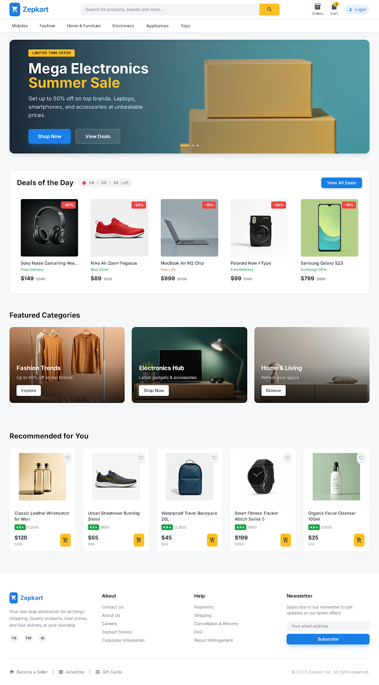
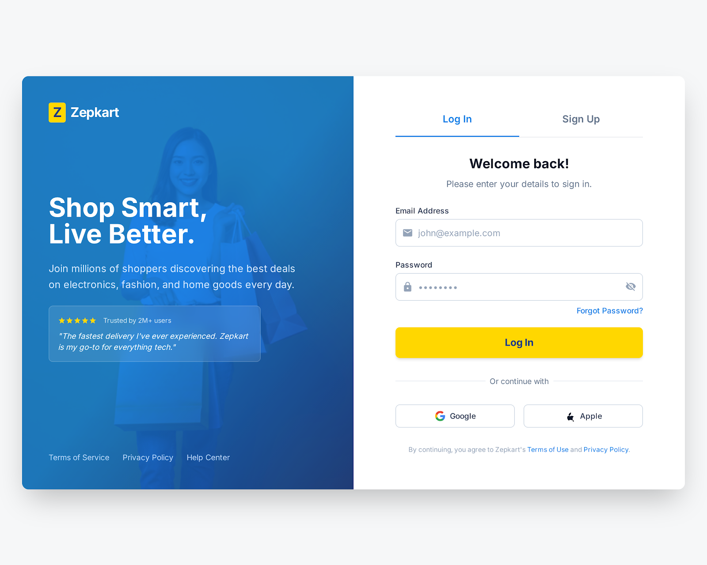
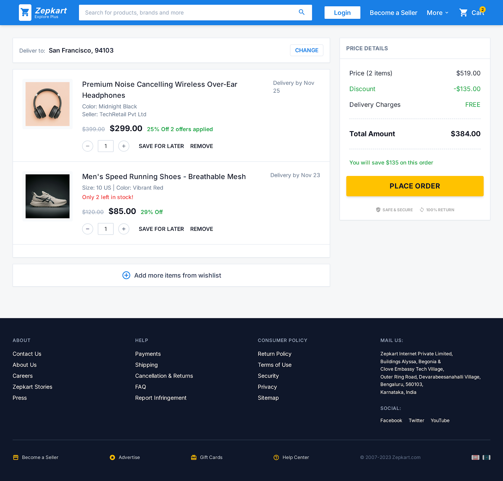

# 🛒 Zepkart

**Zepkart** is a modern, full-stack e-commerce web application that lets users browse products across multiple categories, manage their cart, track orders, and more — all in a clean, responsive UI.

🌐 **Live Demo:** [https://zepkart.nexinlabs.tech](https://zepkart.nexinlabs.tech)

---

## 📸 Screenshots

| Home Page | Product Details |
|-----------|----------------|
|  |  |

| Cart | Orders |
|------|--------|
|  |  |

---

## ✨ Features

- 🏠 **Home Page** — Hero banner, deals of the day, featured categories, and recommended products
- 🔍 **Product Search** — Search across all categories
- 🛍️ **Category Browsing** — Fashion, Electronics, Home & Furniture, Appliances, Toys, and more
- 🛒 **Shopping Cart** — Add, update, and remove items
- 📦 **Order Tracking** — View and manage your orders
- 🔐 **Authentication** — Login / Signup flow
- 📄 **Informational Pages** — About, Contact, FAQ, Help Center, Careers, Become a Seller
- 📋 **Legal Pages** — Privacy Policy, Terms of Service, Shipping Policy, Return Policy
- 📱 **Fully Responsive** — Mobile-first design with a slide-in navigation menu

---

## 🗂️ Project Structure

```
zepkart/
├── client/                     # React + TypeScript frontend (Vite)
│   ├── public/                 # Static assets (favicon, icons)
│   ├── src/
│   │   ├── components/         # Reusable UI components
│   │   │   ├── DealsOfTheDay/
│   │   │   ├── FeaturedCategories/
│   │   │   ├── Footer/
│   │   │   ├── Header/
│   │   │   ├── HeroBanner/
│   │   │   ├── Layout/
│   │   │   ├── ProductCard/
│   │   │   └── RecommendedProducts/
│   │   ├── pages/              # Route-level page components
│   │   ├── utils/              # Utility/helper functions
│   │   ├── assets/             # Images and static assets
│   │   ├── App.tsx             # Root component with routing
│   │   ├── main.tsx            # Entry point
│   │   └── index.css           # Global styles
│   ├── designs/                # Design screenshots
│   ├── package.json
│   └── vite.config.ts
│
├── backend/                    # Node.js / Express API (coming soon)
│   └── src/
│       ├── config/             # App and DB configuration
│       ├── controllers/        # Route handler logic
│       ├── middleware/         # Custom Express middleware
│       ├── models/             # Database models / schemas
│       ├── routes/             # API route definitions
│       └── utils/              # Utility/helper functions
│
├── .gitignore
├── LICENSE
└── README.md
```

---

## 🚀 Getting Started

### Prerequisites

- [Node.js](https://nodejs.org/) v18+
- [Bun](https://bun.sh/) (recommended) or npm

### Frontend Setup

```bash
cd client
bun install          # or: npm install
bun run dev          # or: npm run dev
```

The frontend will start at **http://localhost:5173**

### Backend Setup

```bash
cd backend
npm install
npm run dev
```

> The backend API is under active development. Stay tuned!

---

## 🛠️ Tech Stack

### Frontend
| Technology | Purpose |
|------------|---------|
| [React 19](https://react.dev/) | UI library |
| [TypeScript](https://www.typescriptlang.org/) | Type safety |
| [Vite](https://vitejs.dev/) | Build tool & dev server |
| [Tailwind CSS 4](https://tailwindcss.com/) | Utility-first styling |
| [React Router v7](https://reactrouter.com/) | Client-side routing |
| [Lucide React](https://lucide.dev/) | Icon library |

### Backend *(Planned)*
| Technology | Purpose |
|------------|---------|
| [Node.js](https://nodejs.org/) | Runtime environment |
| [Express](https://expressjs.com/) | Web framework |
| [MongoDB](https://www.mongodb.com/) | Database |
| [Mongoose](https://mongoosejs.com/) | ODM for MongoDB |
| [JWT](https://jwt.io/) | Authentication |

---

## 📜 License

This project is licensed under the [MIT License](LICENSE).

---

## 🤝 Contributing

Contributions are welcome! Please open an issue or submit a pull request.

1. Fork the repository
2. Create your feature branch: `git checkout -b feature/your-feature`
3. Commit your changes: `git commit -m 'Add your feature'`
4. Push to the branch: `git push origin feature/your-feature`
5. Open a Pull Request

---

## 📬 Contact

For queries or support, visit [https://zepkart.nexinlabs.tech/contact](https://zepkart.nexinlabs.tech/contact)
